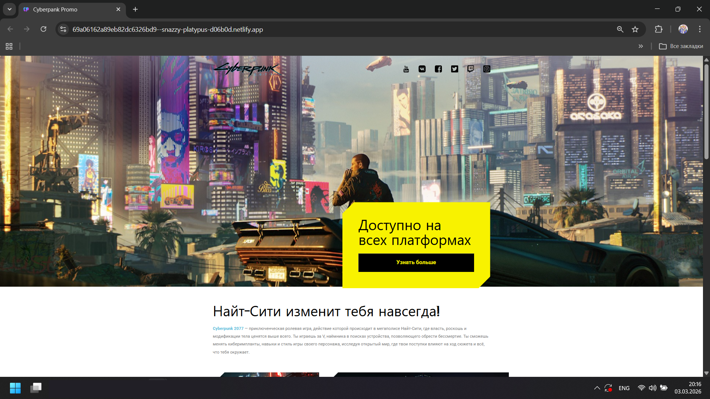

# Сайт посвященной промо акции к выходу Cyberpunk 2077

## О проекте

Это учебный проектпосвященной промо акции к выходу Cyberpunk 2077. 

## Функционал

- Заявки на участие в розыгрыше

## Стек технологий

- **Frontend:** React, Redux Toolkit, TypeScript, React Router
- **Стили:** SCSS
- **Сборка:** Vite

## Установка и запуск

1.  Склонировать репозиторий:
    `git clone https://github.com/твой-логин/название-репозитория.git`
2.  Перейти в папку с проектом:
    `cd название-репозитория`
3.  Установить зависимости:
    `npm install`
4.  Запустить проект:
    `npm run dev`

## Демо

Посмотреть живую версию можно здесь: [https://snazzy-platypus-d06b0d.netlify.app/](ссылка)

## Доступные скрипты

В директории проекта вы можете выполнить следующую команду: 

### `npm run dev`

Запускает приложение в режиме разработки.

Страница будет перезагружаться при внесении изменений.\
Вы также можете увидеть ошибки линтинга в консоли.

### `npm run build`

Собирает приложение для продакшена в папку `build`.
В продакшен-режиме корректно упаковывает React и оптимизирует сборку для достижения наилучшей производительности.

Сборка минифицирована, а имена файлов содержат хеши.
Ваше приложение готово к развертыванию!

### `npm run lint`

Запускает скрипт проверяющий все файлы проекта на соответствие правилам: отступы, кавычки, неиспользуемые переменные, потенциальные ошибки и т.д.

### `npm run preview`

Этот скрипт делает локальный предпросмотр собранного проекта. После выполнения `npm run build` и получения готовой папки `dist` (или другой), `preview` поднимает простой веб-сервер, который раздает файлы из этой папки.